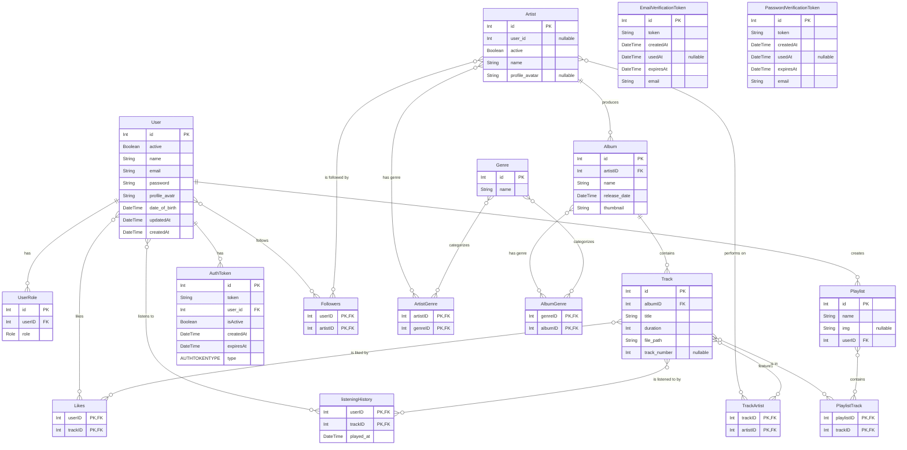

# BE-SERVER 

A modern backend service built with a scalable architecture and industry-standard tooling.  
Designed for maintainability, performance, and long-term growth.

---

## 🛠 Tech Stack


---

## 🚀 Getting Started

### Prerequisites
Ensure the following tools are installed on your system:

- **Bun** (recommended runtime)
- **Node.js** (LTS or newer)
- **Docker** & **Docker Compose**
- **PostgreSQL** (if running without Docker)

---

### Installation

```bash
bun install
```

### Environment Setup
- Copy the .env file (see the template in .env.example) 

### Run Docker 

- Install the docker extension in VSCODE. 
- After it, right-mouse button click to the docker-compose.yml file in the project. 
- You will see Compose up - Select Devices. Click to it and chooose postgres sql and minio-app. Turn off the api services. Click **Go** to build these containers. 

### Install prisma 
- **Cautions**: Please confirm that you already have **.env** files in the root of your project. 
- Run these commands step by step: 
```bash
bun prisma db push 
bun prisma generate 
``` 

## START THE APPLICATION 
- Dev Mode: 
```bash 
bun dev 
``` 
- Production Mode: (Do not touched)
```bash
bun build 
bun start  
```

## Folder Structure 
```
/
├── .husky/              # Git hooks for pre-commit checks
├── dist/                # Compiled TypeScript output
├── prisma/              # Prisma schema, migrations, and seeds
│   ├── migrations/      # Database migration files
│   └── schema.prisma    # Main Prisma schema file
├── src/                 # Main application source code
│   ├── app/             # Core application modules
│   │   ├── auth/        # Authentication-related logic
│   │   ├── user/        # User management logic
│   │   └── ...          # Other business domain modules
│   ├── common/          # Shared utilities, constants, and decorators
│   │   ├── constants/   # Application-wide constants
│   │   ├── decorators/  # Custom decorators
│   │   └── utils/       # Utility functions
│   ├── configs/         # Configuration files (e.g., database, auth)
│   ├── database/        # Database connection and seeding logic
│   ├── generated/       # Auto-generated code (e.g., Prisma Client)
│   ├── shared/          # Shared modules and services
│   └── main.ts          # Application entry point
├── .env                 # Environment variables (local)
├── .env.example         # Example environment variables
├── .gitignore           # Files and folders to ignore in Git
├── docker-compose.yml   # Docker Compose configuration
├── Dockerfile           # Dockerfile for building the application image
├── nest-cli.json        # NestJS CLI configuration
└── package.json         # Project dependencies and scripts
```

## Database Diagram
